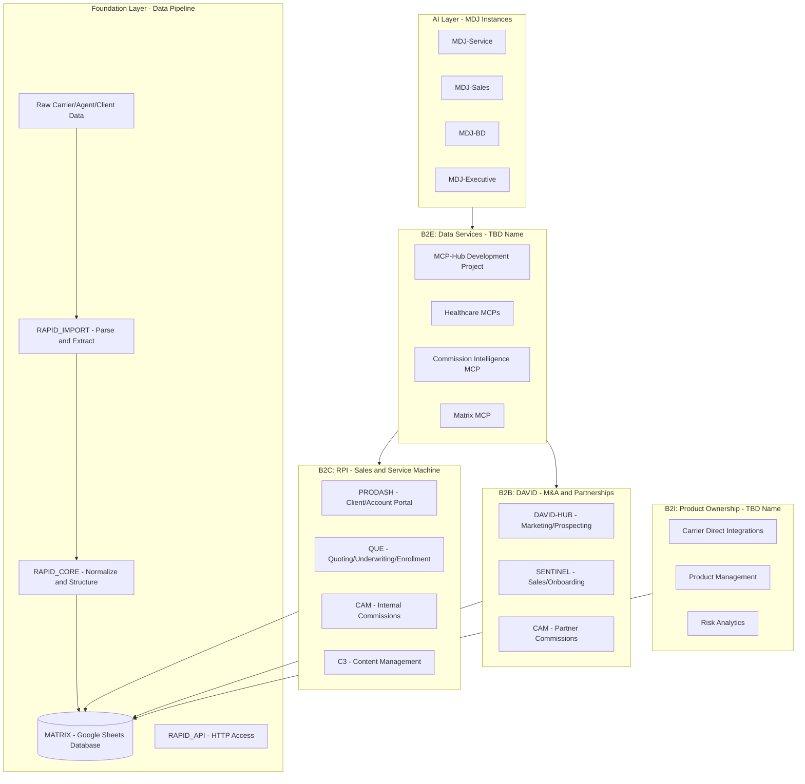
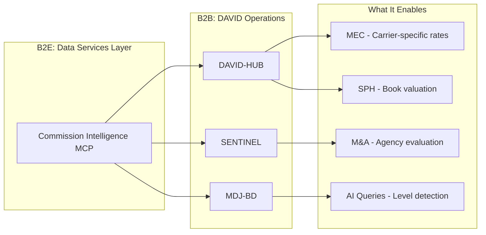

# RPI Empire: Complete Tech + Data Platform Architecture

## The Four Channels

| Channel | Brand | Purpose | Revenue Model |

|---------|-------|---------|---------------|

| **B2C** | RPI (Retirement Protectors, Inc.) | Direct Sales + Service Machine | FYC, renewals, advisory fees, product ownership |

| **B2B** | DAVID (Disruptive And Vertically Integrated Distribution) | M&A + Partnerships Engine | Cross-sell, service fees, rollup equity |

| **B2E** | TBD | Data Services Product Suite | SaaS licensing, analytics fees |

| **B2I** | TBD | Proprietary Product Ownership | 50% of NET Premium |

---

## Complete Platform Architecture



---

## Channel-by-Channel Tech Stack

### B2C: RPI (Retirement Protectors, Inc.)

**Purpose**: Direct sales and service for Health + Wealth + Legacy

| System | Status | Function |

|--------|--------|----------|

| **PRODASH** | Building | Client/Account management, RMD tracking |

| **QUE** | Building | Quoting / Underwriting / Enrollment tool |

| **CAM** | Live | Commission processing for internal agents (RPI_SALES_TEAM_TIERS) |

| **C3** | Building | Content management, campaigns, compliance |

| **CEO Dashboard** | Exists | Executive metrics |

**MDJ Instances**:

- MDJ-Service-Medicare (Susan, Nikki)
- MDJ-Service-Retirement (Christa, Nikki)
- MDJ-Sales-Medicare (Lucas, Lacy, Vinnie)
- MDJ-Sales-Retirement (Archer, Alex, Shane)

**MCPs Needed**:

- prodash-mcp, que-mcp, npi-registry, cms-coverage, matrix-mcp

---

### B2B: DAVID (Disruptive And Vertically Integrated Distribution)

**Purpose**: M&A acquisition engine + partnership recruitment

| System | Status | Function |

|--------|--------|----------|

| **DAVID-HUB** | Live | Marketing/Prospecting workflow for MAPs |

| **SENTINEL** | Building | Sales/Onboarding workflow (ingests from HUB) |

| **CAM** | Live | Partner commission processing (PARTNER_SHARE_TIERS) |

**DAVID-HUB → SENTINEL Flow**:

```
DAVID-HUB (Marketing/Prospecting) → SENTINEL (Sales/Onboarding)
       "Find & qualify MAPs"            "Close & integrate MAPs"
```

**DAVID-HUB Calculators**:

- **MEC** (Merger Earnings) - "What if I merge into DAVID?"
- **PRP** (Partnership Revenue) - "What's my partnership potential?"
- **SPH** (Succession Planning) - "What's my book worth?"

**MDJ Instances**:

- MDJ-BD (Matt, M&A team)

**MCPs Needed**:

- david-mcp, sentinel-mcp, cam-mcp, commission-intelligence-mcp, matrix-mcp

---

### B2E: Data Services (Name TBD)

**Purpose**: RPI's data + tech advantage packaged as products

| System | Status | Function |

|--------|--------|----------|

| **MCP-Hub** | Active | Development project - all MCP logic/integrations built here |

| **Healthcare MCPs** | Built | NPI, ICD-10, CMS Coverage, Blue Button, Medicare Plans, Formulary, Pharmacy Network |

| **Commission Intelligence MCP** | To Build | Level detection, rate matrices, partnership value |

| **Matrix MCP** | Planned | AI access layer to query MATRIX |

| **QUE** | Building | Quoting/Underwriting/Enrollment (also serves B2C) |

**MCP-Hub Contains**:

- `healthcare-mcps/` - Healthcare reference MCPs
- `commission-intelligence/` - Commission MCP (to build)
- `matrix-mcp/` - MATRIX access MCP (future)
- Integration testing, documentation

**This IS the "Data + Tech Advantage" from the Complete Vision**:

- CMS BlueButton integration
- EHR integrations
- Platinum Client Avatar filter
- Proactive Service Model data

**Healthcare MCPs** (in `healthcare-mcps/src/`):

- `npi-registry.js` - Provider lookup
- `icd10-codes.js` - Diagnosis/procedure codes
- `cms-coverage.js` - Medicare coverage info
- `blue-button-parser.js` - Parse Medicare.gov data
- `medicare-plans.js` - Plan search/compare
- `formulary-lookup.js` - Drug coverage
- `pharmacy-network.js` - Pharmacy network status

**Matrix MCP Architecture** (Option A - AI orchestrates multiple MCPs):

```
MDJ needs commission data? → Calls Commission Intelligence MCP
MDJ needs client list?     → Calls Matrix MCP (queries MATRIX)
MDJ needs NPI lookup?      → Calls NPI Registry MCP
```

Each MCP is independent. MDJ/Claude orchestrates which to call.

---

### B2I: Product Ownership (Name TBD)

**Purpose**: Proprietary products with 50% of NET premium economics

| System | Status | Function |

|--------|--------|----------|

| **Carrier API Integrations** | Future | Direct carrier system connections |

| **Product Management System** | Future | Track proprietary product economics |

| **Risk Analytics** | Future | Loss ratio monitoring, claims analysis |

**This enables the Complete Vision's carrier proposition**:

- Pre-qualified, curated risk
- Proactive service ownership
- Eliminated distribution cost
- 50% of net premium structure

---

## Foundation Layer (Data Ingestion Pipeline)

The RAPID Libraries bring in raw data, normalize it, and structure it into MATRIX for use by the Apps.

```
┌─────────────────────────────────────────────────────────────────┐
│                    RAW DATA SOURCES                              │
│  Carrier Feeds │ Comp Statements │ BoB Exports │ Manual Entry   │
└─────────────────────────────────────────────────────────────────┘
                              ↓
┌─────────────────────────────────────────────────────────────────┐
│                    RAPID_IMPORT (GAS)                            │
│  Parse carrier formats, extract fields, handle variations        │
└─────────────────────────────────────────────────────────────────┘
                              ↓
┌─────────────────────────────────────────────────────────────────┐
│                    RAPID_CORE (GAS Library)                      │
│  CORE_Normalize → CORE_Match → CORE_Database → CORE_Carriers    │
│  CORE_Financial (FYC, renewals, projections, valuations)        │
└─────────────────────────────────────────────────────────────────┘
                              ↓
┌─────────────────────────────────────────────────────────────────┐
│                    MATRIX (Google Sheets Database)               │
│  Structured, normalized data ready for Apps                      │
└─────────────────────────────────────────────────────────────────┘
                              ↓
┌─────────────────────────────────────────────────────────────────┐
│              RAPID_API (HTTP endpoints for external access)      │
└─────────────────────────────────────────────────────────────────┘
                              ↓
┌─────────────────────────────────────────────────────────────────┐
│                    GAS APPS (UI Layer)                           │
│  DAVID-HUB │ SENTINEL │ CAM │ PRODASH │ QUE │ C3 │ CEO Dashboard│
└─────────────────────────────────────────────────────────────────┘
```

| System | Type | Purpose |

|--------|------|---------|

| **RAPID_IMPORT** | GAS | Parse raw carrier/comp data, extract fields |

| **RAPID_CORE** | GAS Library | Normalize, match, validate, structure data |

| **MATRIX** | Google Sheets | Core database - the single source of truth |

| **RAPID_API** | GAS | HTTP endpoints for external system access |

| **_RPI_STANDARDS** | Documentation | Universal standards, agent frameworks |

**MATRIX Tabs**:

- `_CARRIER_MASTER` - Carrier registry
- `_MAPD_COMP_GRID` - Medicare Advantage rates
- `_MEDSUP_COMP_GRID` - Medicare Supplement rates (to be populated)
- `_AGENT_MASTER` - Agent records
- `_CLIENT_MASTER` - Client records
- `_ACCOUNT_MASTER` - Policy/account records
- `_REVENUE_MASTER` - Commission/revenue records

---

## AI Layer: MDJ Instances

| Instance | Channel | Users | MCPs Required |

|----------|---------|-------|---------------|

| MDJ-Service-Medicare | B2C | Susan, Nikki | prodash-mcp, npi-registry, cms-coverage, matrix-mcp |

| MDJ-Service-Retirement | B2C | Christa, Nikki | prodash-mcp, cam-mcp, matrix-mcp |

| MDJ-Sales-Medicare | B2C | Lucas, Lacy, Vinnie | prodash-mcp, npi-registry, plan-optimizer-mcp |

| MDJ-Sales-Retirement | B2C | Archer, Alex, Shane | prodash-mcp, cam-mcp, matrix-mcp |

| MDJ-BD | B2B | Matt, M&A team | david-mcp, sentinel-mcp, commission-intelligence-mcp, matrix-mcp |

| MDJ-Executive | All | Josh, John | All MCPs |

| MDJ-Marketing | B2C | Aprille | c3-mcp, matrix-mcp |

---

## Commission Intelligence: Where It Fits

Commission Intelligence is part of **B2E (Data Services)** but serves **B2B (DAVID)** operations:



It enables:

- **B2B Partnership value calculations** in DAVID-HUB (enhancing MEC/PRP/SPH)
- **M&A Agency valuation** in SENTINEL
- **MDJ-BD AI queries** for Matt's team
- **B2I Transition analysis** - comparing traditional commission cost vs product ownership economics

---

## Build Sequence (Critical Path)

```
PHASE 1 (Current): Foundation + Reference MCPs
├── MATRIX (done)
├── RAPID Libraries (done)
├── Healthcare MCPs (done)
└── Commission Intelligence MCP (this plan)

PHASE 2: Data Access MCPs
├── matrix-mcp (AI access to MATRIX)
└── drive-direct-mcp

PHASE 3: Application MCPs
├── prodash-mcp (B2C)
├── que-mcp (B2C + B2E)
├── david-mcp (B2B - Marketing/Prospecting)
├── sentinel-mcp (B2B - Sales/Onboarding)
└── cam-mcp

PHASE 4: MDJ Instances
├── MDJ-Service-Medicare (first)
├── MDJ-Sales-Medicare (second)
├── MDJ-BD (third)
└── Full coverage

PHASE 5: B2I Infrastructure
├── Carrier API integrations
├── Product management system
└── Risk analytics
```

---

## Two Data Paths: Pre-Partnership vs Post-Partnership

**Critical Architecture Distinction:**

| Phase | Data Path | What Happens |

|-------|-----------|--------------|

| **Pre-Partnership** | Raw Data → Commission Intelligence MCP → DAVID-HUB | Analyze prospect's data directly, show partnership value |

| **During Sales** | SENTINEL tracks the deal | Runs alongside (doesn't ingest the data) |

| **Post-Partnership** | Raw Data → RAPID_IMPORT → MATRIX → CAM | Partner data formally ingested, operational processing |

```
┌────────────────────────────────────────────────────────────────────────────┐
│                        PRE-PARTNERSHIP (Prospecting)                        │
│                                                                            │
│   Prospect's Raw Data ──→ Commission Intelligence MCP ──→ DAVID-HUB       │
│   (BoB, Comp Statements)    (Detect levels, calc value)    (Show MEC/PRP) │
│                                                                            │
│                                    ↓ (If they proceed)                     │
│                                                                            │
│                        DURING SALES (Onboarding)                           │
│                                                                            │
│                              SENTINEL                                      │
│                    (Tracks deal, runs alongside)                           │
│                    (Does NOT ingest the data yet)                          │
│                                                                            │
│                                    ↓ (Once they're a partner)              │
│                                                                            │
│                        POST-PARTNERSHIP (Operational)                       │
│                                                                            │
│   Partner's Ongoing Data ──→ RAPID_IMPORT ──→ MATRIX ──→ CAM              │
│   (Now part of RPI)          (Parse/normalize)  (Store)   (Process comm)  │
│                                                                            │
└────────────────────────────────────────────────────────────────────────────┘
```

**Commission Intelligence MCP vs RAPID_IMPORT:**

| System | Purpose | What It Does |

|--------|---------|--------------|

| **RAPID_IMPORT** | Data Movement | Parse carrier formats, normalize, store in MATRIX |

| **Commission Intelligence MCP** | Data Intelligence | Detect commission levels, understand what the data MEANS |

RAPID_IMPORT asks: "How do I get this data into MATRIX?"

Commission Intelligence MCP asks: "What commission level is this? What's it worth?"

They work together:

- Pre-partnership: Commission Intelligence MCP analyzes raw data directly (no RAPID needed)
- Post-partnership: RAPID_IMPORT moves data → CAM calls Commission Intelligence MCP for rate lookups

---

## Commission Intelligence MCP: Implementation Details

**Location**: `MCP-Hub/healthcare-mcps/src/commission-intelligence.js`

**Q&A - Architecture Decisions:**

| Question | Answer |

|----------|--------|

| Will this become part of SENTINEL? | **No** - stays separate MCP. SENTINEL CALLS it but doesn't absorb it. |

| Will this live in MCP-Hub? | **Yes** - now and forever. MCP-Hub is home for all MCPs. |

| How to access until SENTINEL is rebuilt? | **Cursor/Claude** calls MCP directly. We can run analyses now. |

| Is this like RAPID_IMPORT? | **No** - RAPID_IMPORT = data MOVEMENT. Commission Intelligence = data INTELLIGENCE. |

**Files to create:**

- `src/commission-intelligence.js` - MCP server with tools
- `src/data/commission-rates.json` - Carrier rate data (Aetna levels, Mutual grids)
- `src/data/house-config.json` - DAVID/RPI contracted rates (Spark Level 12, etc.)

**Tools:**

1. `detect_commission_level` - From transaction data, detect carrier/level
2. `get_carrier_rate_matrix` - Get full rate grid for carrier at level
3. `calculate_partnership_value` - Full ROI (commission + PSM + retention + ops)
4. `compare_imo_scenarios` - Compare different IMO options (their level vs DAVID level)
5. `analyze_bob` - Process raw BoB, generate standardized outputs

**Existing code to migrate:**

- [commission_intelligence.py](data/analysis_tools/commission_intelligence.py) - Level detection
- [partnership_calculator.py](data/analysis_tools/partnership_calculator.py) - Value calculation
- [commission_data.json](data/Comp%20Grids/tools/commission_data.json) - Rate structure
- [bob_analyzer.py](data/analysis_tools/bob_analyzer.py) - BoB analysis

---

## Established: Formal Output Suite + Input Requirements

**Location**: `MCP-Hub/data/analysis_tools/`

### Report Templates (Outputs)

| Report | Purpose | Stage | File |

|--------|---------|-------|------|

| **Executive Summary** | High-level agency overview | Intake | `EXECUTIVE_SUMMARY_TEMPLATE.md` |

| **Core Health Report** | Deep dive on Med Supp book | Intake | `CORE_HEALTH_REPORT_TEMPLATE.md` |

| **Ancillary Companion** | Ancillary products analysis | Intake | `ANCILLARY_COMPANION_REPORT_TEMPLATE.md` |

| **Commission Structure Report** | Educate on their current commission levels | Intake | `COMMISSION_STRUCTURE_REPORT_TEMPLATE.md` (to create) |

### Commission Structure Report (New - To Create)

**Purpose**: Educate prospect on their current commission structure

**Stage**: Intake/Analysis (BEFORE DAVID-HUB)

**Contents**:

- Detected commission levels by carrier
- Rate breakdown by product (Plan F, G, N, etc.)
- Rate breakdown by state (state-specific adjustments)
- Rate breakdown by policy year (Year 1-6 vs Year 7+)
- Age band considerations
- Summary of what they're currently earning on their book

**Does NOT Include** (saved for DAVID-HUB MEC):

- DAVID/RPI rates
- Partnership value calculation
- "What you could be earning" comparison

### Minimum Inputs by Report

| Report | Minimum Input | Ideal Input |

|--------|--------------|-------------|

| Executive Summary | BoB (any carrier) | BoB + Comp Statements |

| Core Health Report (Aetna) | BoB only | BoB only |

| Core Health Report (Mutual) | BoB + Comp Statements | BoB + 12+ months Comp |

| Ancillary Companion | BoB (any carrier) | BoB |

### Data Source Map

**Full documentation**: `data/analysis_tools/DATA_SOURCE_MAP.md`

Key mappings:

- 📊 **BoB** = Book of Business report
- 📝 **Comp** = Compensation statements
- 🔗 **Both** = Requires joining BoB + Comp
- ➕ **Calc** = Calculated/derived
- ❌ **N/A** = Not available from carrier

### Data Collection Checklist (for new agency)

1. **Identify Carriers** - List all carriers in book
2. **Collect BoB Reports** - Aetna, Mutual, others
3. **Collect Comp Statements** - Mutual requires these for rate analysis
4. **Verify Data** - Check column names, date ranges, policy counts

---

## Future: Commission Rate Browser UI

**Question**: Will we have UI to view carriers, contract levels, states, products?

**Answer**: Yes, planned but not immediate.

**What it would show:**

- All carriers and their level structures
- **Their levels** (detected from their data)
- **Our levels** (DAVID/RPI contracted rates via Spark, etc.)
- State-specific adjustments
- Product variations
- Age band differences

**Implementation Options:**

1. **Simple**: JSON viewer in Cursor (we have now)
2. **Medium**: Google Sheet in MATRIX (`_MEDSUP_COMP_GRID` tab)
3. **Full**: Web UI on DAVID-HUB (future)

For now: Commission Intelligence MCP exposes the data, we query via Cursor/Claude.

---

## Success Criteria

1. Complete ecosystem map with all 4 channels documented
2. MCP server running with 4 core tools
3. Can detect Aetna level from single transaction
4. DAVID-HUB MEC shows carrier-specific commission comparison
5. MDJ-BD can answer "What's their commission level?" queries

---

## Appendix A: App Integration Reference

### MATRIX Commission Tabs

| Tab | Purpose |
|-----|---------|
| `_COMP_GRID_MAPD` | Medicare Advantage rates |
| `_COMP_GRID_MEDSUPP` | Medicare Supplement rates |
| `_COMP_GRID_PDP` | Prescription Drug Plan rates |
| `_COMP_GRID_LIFE` | Life insurance rates |
| `_COMP_GRID_ANNUITY` | Annuity rates |
| `_CARRIERS` | Carrier master list |

### CAM Functions (Existing)

- `getCompGridByProduct(productType)` - Get all entries for a product
- `getCarrierCompRate(carrierId, productType)` - Carrier-specific rate lookup
- `calculateTransactionCommission(transaction)` - Uses carrier rates

**Default Rates (fallback):** MAPD $600/enrollment, MEDSUPP 20%, PDP $100/enrollment

### SENTINEL MAPD Logic

**Commission Model:**
```
TOTAL = Base (CMS FMV) + Override (from Grid) + Co-Op
Initial: $694 (2026) + $0-175 override + $0-50 co-op
Renewal: $347 (2026) + $0-65 override
```

**Contract Levels:** STREET, LOA, GA, MGA, GMO, MMO, SGA, SMO, RMO, FMO

**Spark Sheet:** `https://docs.google.com/spreadsheets/d/1aOCiuuRLuDwAP6gPwO08gDkR9sOGHKqBzGKpn_dbvak`

### Integration Points

| App | Current State | CI-MCP Integration |
|-----|---------------|-------------------|
| **CAM** | Has structure, simplified defaults | Call `get_agent_rates` for lookups |
| **SENTINEL** | Has MAPD logic | Delegate MedSupp to CI-MCP |
| **DAVID-HUB** | `getCompGrid()` empty | CI-MCP fills the gap |
| **RAPID_CORE** | Planned but not implemented | Call CI-MCP for `getCommissionRate()` |

### MCP vs MATRIX Relationship

**MATRIX** = Database (source of truth, human-editable)  
**CI-MCP** = Calculation service (stateless, AI-callable)  

MCP reads from MATRIX grids but doesn't replace them. Apps call CI-MCP for calculations, MATRIX for CRUD.