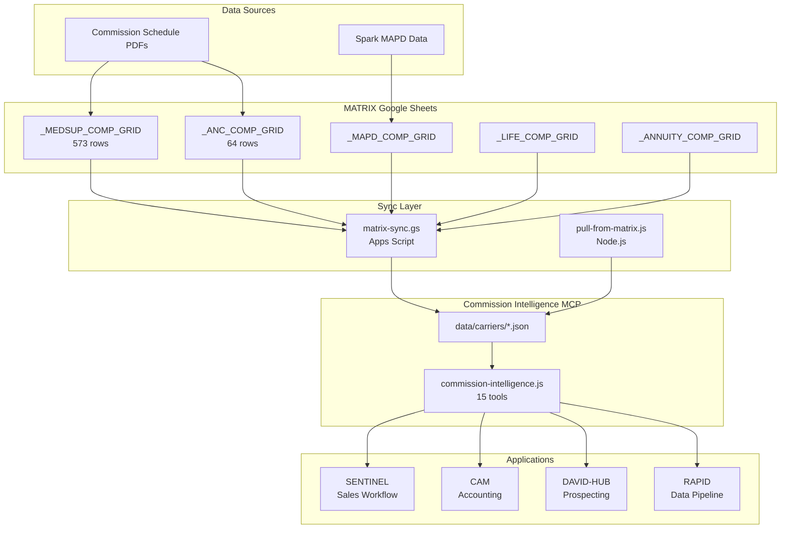

# Commission Intelligence - Complete Status Report

## 1. WHAT YOU HAVE NOW

### MATRIX Google Sheets (Source of Truth)

**`_MEDSUP_COMP_GRID`** - 573 data rows

| Carrier | Charter | Levels | Rows | Status |

|---------|---------|--------|------|--------|

| Aetna | MULTIPLE | 04-13 (all 10) | 134 | COMPLETE |

| AFLAC | TierOne | 04-13 (all 10) | 139 | COMPLETE |

| Mutual of Omaha | MULTIPLE | 24, 25, 26 | 38 | Partial (Iowa pivot) |

| Wellabe | MULTIPLE | 24 | 62 | Partial (state variations) |

| GTL | GTL | GA | 55 | Single level |

| Chubb | ACE | 04 | 54 | Single level |

| Chubb | INA | 04 | 55 | Single level |

| Med Mutual | Reserve National | Tier5 | 21 | Single level |

**`_ANC_COMP_GRID`** - 64 data rows

- Aetna Complementary Health Products (Cancer, DVH, HIP, Recovery Care, etc.)
- Wellabe (Cancer, Critical Illness, Dental, Hospital Indemnity, Short-Term Care)
- GTL (Hospital Indemnity)
- Mutual of Omaha (Hospital Indemnity)
- United of Omaha (Final Expense)
- AFLAC (Final Expense)

### Schema Design (v2 - JSON Rate Schedule)

**Columns:** carrier, charter, level, level_type, state, plan_type, age_band, rate_schedule, gi_rate, prod_req, effective_date, notes

**Key Innovation:** `rate_schedule` is JSON that handles ANY policy year structure:

```json
{"1-6":26,"7+":4.25}           // Standard
{"1-3":34,"4+":6.25}           // Michigan
{"1-7":22,"8+":0}              // Ohio (no renewal)
{"1-6":24,"7-10":7.5,"11+":5.25}  // GPM (pays Y11+)
{"all":20}                      // Flat rate
```

### Business Rules Documented

- **Aetna/AFLAC:** Levels 04-13, identical structure (AFLAC = TierOne charter)
- **Mutual of Omaha:** Iowa pivot for level naming (Level "26" = Iowa F/G pays 26%)
- **Wellabe:** Iowa pivot, levels vary completely by state
- **Chubb:** ACE and INA are charters (not "ACE/Chubb")
- **Med Mutual:** Carrier, Reserve National is the charter
- **MULTIPLE:** Used when rates apply across all charters

### Commission Intelligence MCP Server

**File:** [commission-intelligence/src/commission-intelligence.js](commission-intelligence/src/commission-intelligence.js)

**Version:** 6.0.0

**Status:** Configured in mcp.json, runnable

**15 MCP Tools:**

1. `get_agent_rates` - Get commission rates for configured agents
2. `get_state_rates` - Multi-carrier comparison for a state
3. `set_agent_level` - Configure agent commission levels
4. `list_agents` - List all configured agents
5. `calculate_commission` - Calculate commission from premium
6. `list_supported_carriers` - List carriers with rate data
7. `get_house_levels` - Get DAVID + RPI contracted levels
8. `get_mapd_rates` - Get MAPD commission rates
9. `get_rpi_mapd_levels` - Get RPI partnership MAPD levels
10. `get_life_rates` - Get Life insurance rates from MATRIX
11. `get_annuity_rates` - Get Annuity rates from MATRIX
12. `pivot_rate_lookup` - Reverse-engineer full grid from single rate
13. `identify_level` - Identify commission level from a rate

### Source PDF Organization

```
commission-intelligence/data/source-pdfs/
├── Aetna/                    # Levels 2-8
├── AFLAC/                    # Level 13
├── Chubb/                    # ACE + INA PDFs
├── GTL/                      # MFGAN Levels
├── Mutual_of_Omaha/          # Parent folder
│   ├── GPM_Health_Life_Med_Supp/
│   ├── Mutual_of_Omaha_HIP/
│   ├── Mutual_of_Omaha_Med_Supp/
│   ├── Omaha_Insurance_Company_Med_Supp/
│   ├── Omaha_Supplemental_Med_Supp/
│   ├── United_of_Omaha_Final_Expense/
│   ├── United_of_Omaha_Med_Supp/
│   └── United_World_Life_Med_Supp/
└── Reserve_National/
```

---

## 2. ECOSYSTEM RELATIONSHIPS



**Key Relationships:**

- MATRIX is the source of truth (human-editable)
- Sync scripts transform MATRIX → JSON for MCP
- MCP provides stateless calculation service to all apps
- Apps never talk to MATRIX directly for commission calculations

---

## 3. CODE UPDATES NEEDED

### HIGH PRIORITY (Required for system to work)

**A. [commission-intelligence/sync/pull-from-matrix.js](commission-intelligence/sync/pull-from-matrix.js)**

- Currently has placeholder MCP integration
- Needs to parse new JSON `rate_schedule` column
- Functions `transformMedsupData()` and `transformAncData()` already updated for new schema
- Need to wire up actual Google Drive MCP calls

**B. [commission-intelligence/src/commission-intelligence.js](commission-intelligence/src/commission-intelligence.js)**

- Currently reads from old JSON structure in `data/carriers/`
- Needs to handle new `rate_schedule` JSON format
- Lookup functions need `findRateForPolicyYear()` logic
- Estimated: ~50 lines to add rate schedule parsing

**C. Regenerate JSON files from MATRIX**

- Run sync to pull new _MEDSUP_COMP_GRID data
- Run sync to pull new _ANC_COMP_GRID data
- Files affected:
  - `data/carriers/medsup-rates.json` (new)
  - `data/carriers/anc-rates.json` (new)
  - Update existing carrier JSON files

### MEDIUM PRIORITY (For full integration)

**D. SENTINEL Integration**

- File: SENTINEL Apps Script (in Google Drive)
- Update `getMedSuppCompRates()` to call CI-MCP
- Update BoB analysis to use MCP for multi-carrier comparisons

**E. CAM Integration**

- File: CAM Apps Script (in Google Drive)  
- Replace hardcoded rates with CI-MCP lookups
- Add state-specific rate handling

### LOW PRIORITY (Future)

**F. DAVID-HUB Integration**

- Prospecting value propositions using CI-MCP
- Street vs contracted rate comparisons

---

## 4. DEPLOYMENT STATUS

### NOT YET COMMITTED/PUSHED

Git shows the entire `commission-intelligence/` folder is **untracked**:

```
Untracked files:
  commission-intelligence/    # ENTIRE FOLDER
  docs/HANDOFF-Meeting-Intelligence-System.md
  healthcare-mcps/... (various)
  rpi-meeting-processor/
```

### What Needs to Happen

1. `git add commission-intelligence/`
2. `git commit -m "Add commission-intelligence MCP with MATRIX sync"`
3. `git push origin main`

### MCP Configuration

The MCP IS configured in `mcp.json` and will work once files are present:

```json
"commission-intelligence": {
  "command": "node",
  "args": ["/Users/joshd.millang/Projects/MCP-Hub/commission-intelligence/src/commission-intelligence.js"]
}
```

---

## 5. ULTIMATE TEST READINESS

**Can test now:**

- Query _MEDSUP_COMP_GRID directly via Google Drive MCP
- Query _ANC_COMP_GRID directly via Google Drive MCP
- Verify data is correct in sheets

**Cannot test until code updates (Section 3A-C):**

- CI-MCP rate lookups using new schema
- Automated sync from MATRIX
- End-to-end: "What's Aetna Level 08 in Michigan for Plan N age 65-79?"

**After deployment:**

- Full MCP tool testing
- Integration with SENTINEL/CAM/DAVID-HUB