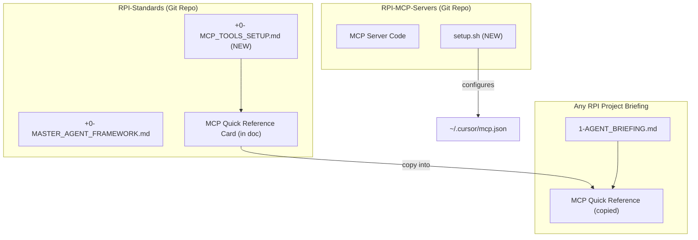

# Add MCP Tools Documentation to RPI-Standards

## Overview

Create MCP documentation in `RPI-Standards/` that includes:

1. Full setup guide (for new machine onboarding)
2. Quick reference card (for inclusion in agent briefing scopes)
3. Portable setup script (works on any machine after clone)

## Architecture



## What Gets Created

### 1. MCP Standards Document

**File:** `RPI-Standards/+0- MCP_TOOLS_SETUP.md`

| Section | Purpose |

|---------|---------|

| What is MCP | Brief explanation for agents |

| Setup Instructions | Clone, install, run script |

| Available Tools | Full tool reference |

| Quick Reference Card | Copy/paste into project briefings |

| When to Use | Triggers for in-session use |

| Troubleshooting | Common issues |

### 2. MCP Quick Reference Card (Template)

This goes IN the standards doc but is designed to be **copied into project briefings**:

```markdown
## MCP Tools Quick Reference

Available in Cursor via RPI-MCP-Servers:

| Tool | Use When... | Example |
|------|-------------|---------|
| `lookup_npi` | You have a provider NPI to verify | "Look up NPI 1234567890" |
| `search_providers` | Finding providers by name/location | "Find cardiologists in Phoenix, AZ" |
| `validate_npi` | Checking if NPI format is valid | "Is NPI 9876543210 valid?" |
| `search_diagnosis_codes` | Need ICD-10 diagnosis code | "ICD-10 code for type 2 diabetes" |
| `search_procedure_codes` | Need ICD-10 procedure code | "ICD-10 code for hip replacement" |
| `lookup_code` | Have a code, need description | "What is ICD-10 code E11.9?" |
| `explain_medicare_parts` | Medicare coverage questions | "What does Medicare Part B cover?" |
| `check_dme_coverage` | DME coverage questions | "Is a wheelchair covered by Medicare?" |

Setup: See `RPI-Standards/+0- MCP_TOOLS_SETUP.md`
```

### 3. Setup Script

**File:** `RPI-MCP-Servers/setup.sh`

```bash
#!/bin/bash
# Configures Cursor MCP for this repo location
# Run after: git clone && npm install
```

Detects repo path, updates `~/.cursor/mcp.json`, preserves existing configs.

## Usage Flow

```
SETUP (Once per machine):
1. git clone RPI-MCP-Servers
2. cd RPI-MCP-Servers && npm install
3. ./setup.sh
4. Restart Cursor

IN-SESSION (Every project):
- Agent reads briefing → sees MCP Quick Reference
- Agent needs provider data → uses lookup_npi
- Agent needs diagnosis code → uses search_diagnosis_codes
- No extra steps, tools just work
```

## Files Modified/Created

| File | Action |

|------|--------|

| `RPI-Standards/+0- MCP_TOOLS_SETUP.md` | Create - full docs + quick reference card |

| `RPI-MCP-Servers/setup.sh` | Create - portable setup script |

| `RPI-Standards/+0- MASTER_AGENT_FRAMEWORK.md` | Update - add reference to MCP docs |

## Project Integration Example

After this, project briefings like `PRODASH/1-AGENT_BRIEFING.md` can add:

```markdown
## MCP Tools Available

[Paste Quick Reference Card from RPI-Standards]
```

And agents immediately know what tools they can use during development.