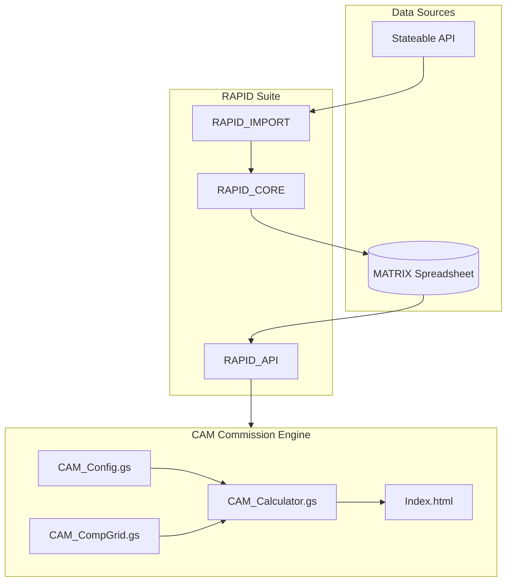

# CAM Commission Grid Implementation

## Architecture Overview



## Key Files to Modify

| File | Changes |

|------|---------|

| [CAM_Config.gs](CAM_Config.gs) | Add RPI_SALES_TEAM_TIERS, SOURCE_OF_BUSINESS_MULTIPLIERS, PRODUCT_MULTIPLIERS |

| [CAM_CompGrid.gs](CAM_CompGrid.gs) | Update to read from MATRIX comp grid tabs via RAPID_API |

| [Code.gs](Code.gs) | Add API routing for new calculator endpoints |

| [Index.html](Index.html) | Add Commission Calculator UI with tier/multiplier selectors |

---

## Phase 1: Configuration Constants

Add to [CAM_Config.gs](CAM_Config.gs):

### RPI Sales Team Tiers

```javascript
const RPI_SALES_TEAM_TIERS = {
  'spc_iii': { name: 'SPC-III', threshold: 4000000, percent: 0.30 },
  'spc_ii':  { name: 'SPC-II',  threshold: 2500000, thresholdMax: 3999999, percent: 0.275 },
  'spc_i':   { name: 'SPC-I',   threshold: 1800000, thresholdMax: 2499999, percent: 0.25 },
  'ast_iii': { name: 'AST-III', threshold: 1200000, thresholdMax: 1799999, percent: 0.20 },
  'ast_ii':  { name: 'AST-II',  threshold: 600000,  thresholdMax: 1199999, percent: 0.15 },
  'ast_i':   { name: 'AST-I',   threshold: 300000,  thresholdMax: 599999,  percent: 0.125 },
  'cor_iii_atp': { name: 'COR-III (ATP)', threshold: 0, percent: 0.10 },
  'cor_iii_itp': { name: 'COR-III (ITP)', threshold: 0, percent: 0.075 },
  'cor_i':   { name: 'COR-I (New Hire)', threshold: 0, percent: 0.05 }
};
```

### Source of Business Multipliers

```javascript
const SOURCE_OF_BUSINESS_MULTIPLIERS = {
  'merger':      { name: 'Merger',      multiplier: 2.0 },
  'acquisition': { name: 'Acquisition', multiplier: 1.5 },
  'partnership': { name: 'Partnership', multiplier: 1.0 }
};
```

### Product Multipliers

```javascript
const PRODUCT_MULTIPLIERS = {
  'MAPD':    { multiplier: 2.0 },
  'MEDSUPP': { multiplier: 1.5 },
  'PDP':     { multiplier: 1.0 },
  'LIFE':    { multiplier: 1.0 },
  'ANNUITY': { multiplier: 1.0 },
  'FIA':     { multiplier: 1.0 },
  'IUL':     { multiplier: 1.0 }
};
```

---

## Phase 2: RAPID_API Integration

Update [CAM_CompGrid.gs](CAM_CompGrid.gs) to fetch comp grid data from RAPID_API instead of direct MATRIX access:

```javascript
function fetchCompGridFromRAPID(productType) {
  const RAPID_API_URL = PropertiesService.getScriptProperties().getProperty('RAPID_API_URL');
  // GET /compgrid?productType=MAPD
}
```

---

## Phase 3: Commission Calculator Engine

Create new calculation functions in [CAM_CompGrid.gs](CAM_CompGrid.gs):

```javascript
function calculateFullCommission(params) {
  // params: { carrierId, productType, premium, volume, channel, tierKey, sourceOfBusiness }
  
  // 1. Get base carrier rate from comp grid
  // 2. Apply product multiplier
  // 3. Apply source of business multiplier
  // 4. Apply tier percentage (DAVID or RPI based on channel)
  // 5. Return breakdown
}
```

---

## Phase 4: UI Updates

Add to [Index.html](Index.html):

- Channel selector (B2B DAVID / B2C RPI Internal)
- Tier dropdown (auto-populated based on channel)
- Source of Business selector (Merger/Acquisition/Partnership)
- Product type selector with multiplier display
- Real-time commission calculation preview

---

## Revenue Type Tracking

Ensure the system tracks revenue by type as specified:

| Type | Components |

|------|------------|

| **FYC** | ADV (Advance) + OVR (Override) + BNS (Bonus) |

| **REN** | ASE (As-Earned) + OVR (Renewal Overrides) + SVS (Service Fees) |

---

## MATRIX Tabs Referenced

| Tab | Purpose |

|-----|---------|

| `_MAPD_COMP_GRID` | Medicare Advantage carrier rates |

| `_LIFE_COMP_GRID` | Life insurance carrier rates |

| `_ANNUITY_COMP_GRID` | Annuity carrier rates |

| `_CMS_FMV_RATES` | CMS Fair Market Value reference |

| `_REVENUE_MASTER` | Revenue records (via RAPID_API) |

---

## Testing Strategy

1. Unit test tier lookups with known revenue values
2. Verify multiplier calculations match spreadsheet examples
3. End-to-end test: Fetch revenue from RAPID_API, calculate commission, verify output