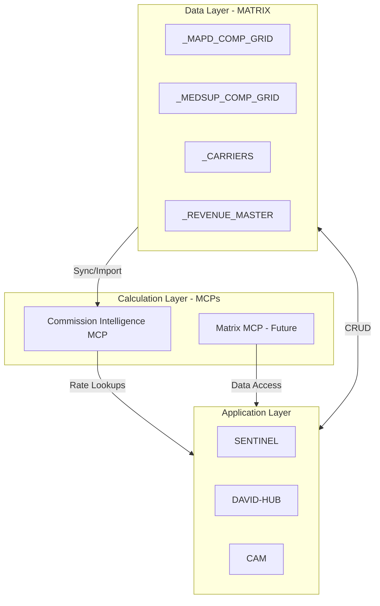

# Commission Ecosystem Integration Analysis

## 1. Existing Resources in CAM and MATRIX

### MATRIX Commission Tabs

CAM references these MATRIX tabs for commission data:

- `_COMP_GRID_MAPD` - Medicare Advantage rates
- `_COMP_GRID_MEDSUPP` - Medicare Supplement rates  
- `_COMP_GRID_PDP` - Prescription Drug Plan rates
- `_COMP_GRID_LIFE` - Life insurance rates
- `_COMP_GRID_ANNUITY` - Annuity rates
- `_CARRIERS` - Carrier master list

### CAM Commission Functions

- `getCompGridByProduct(productType)` - Get all entries for a product
- `getCarrierCompRate(carrierId, productType)` - Carrier-specific rate lookup
- `calculateTransactionCommission(transaction)` - Uses carrier rates

### CAM Default Rates (when carrier not found)

- MAPD: $600 flat per enrollment
- MEDSUPP: 20% of premium
- PDP: $100 flat per enrollment

### CAM Tier Systems

- **B2B Partner Tiers**: Bronze (20%) to Diamond (30%) based on revenue thresholds
- **B2C Sales Team Tiers**: COR-I (5%) to SPC-III (30%)

**Verdict**: CAM has the *structure* but the MATRIX grids appear to be simplified defaults, not full state-by-state rate files like we just built.

---

## 2. SENTINEL / DAVID-HUB Commission Logic - NOT Exhausted

### SENTINEL Has Extensive Commission Logic

**MAPD Commission Model (Two-Tier)**:

```
TOTAL = Base (CMS FMV) + Override (from Grid) + Co-Op
```

**Key MATRIX tabs in SENTINEL**:

- `_MAPD_COMP_GRID` - Override rates by carrier/level (synced from Spark)
- `_MEDSUP_COMP_GRID` - Med Supp rates by carrier/plan/state/level
- `_MAPD_STATE_RATES` - CMS Fair Market Value base rates

**MAPD Functions NOT in our MCP**:

- `getMAPDCompRates(carrier, planYear, state, contractLevel)`
- `uiGetMAPDRatesFromGrid(carrier, productType, contractLevel, state)`
- `syncMAPDFromSparkDirect()` - Syncs from Spark Sheet

**MAPD Contract Levels in SENTINEL**:

- STREET, LOA, GA, MGA, GMO, MMO, SGA, SMO, RMO, FMO

**Spark Sheet Integration**:

- URL: `https://docs.google.com/spreadsheets/d/1aOCiuuRLuDwAP6gPwO08gDkR9sOGHKqBzGKpn_dbvak`
- Contains tiered hierarchy with override rates by carrier/level

### DAVID-HUB Gaps

**Has**:

- MEC (Merger Earnings Calculator) - commission splits by product specialty
- HYPO (Partnership Revenue Projector)
- Partner share tier definitions

**Missing** (referenced but NOT implemented):

- `getCompGrid()` - referenced but empty
- Street vs Contracted level comparisons
- Carrier-specific commission level lookups
- MAPD-specific logic entirely

**Verdict**: SENTINEL has MAPD logic we need. DAVID-HUB needs the Commission Intelligence MCP to fill its gaps.

---

## 3. Will MATRIX Be Replaced?

**No. The MCP is a Calculation Service, not a Database.**



### Relationship Clarification

| System | Role | Commission Intelligence MCP |

|--------|------|----------------------------|

| **MATRIX** | Database (source of truth for revenue, agents, policies) | MCP reads carrier grids, doesn't replace them |

| **CI-MCP** | Calculation service (rate lookups, level detection) | New capability - stateless calculator |

| **CAM** | Accounting system (commission cycles, payouts) | Calls CI-MCP for rate lookups |

| **SENTINEL** | Sales workflow (onboarding, level config) | Calls CI-MCP for rate analysis |

| **DAVID-HUB** | Prospecting (M&A evaluation) | Calls CI-MCP for street vs contracted comparison |

### References to Update

If we want apps to call CI-MCP instead of hardcoded rates:

1. **CAM** - `CAM_CompGrid.gs`:

   - `getCarrierCompRate()` could call CI-MCP tool `get_agent_rates`
   - Default rates fallback still makes sense

2. **SENTINEL** - `SENTINEL_AgencySetup.gs`:

   - `getMedSuppCompRates()` - could delegate to CI-MCP
   - `getMAPDCompRates()` - CI-MCP would need MAPD support first

3. **DAVID-HUB** - `Matrix.gs`:

   - `getCompGrid()` - NOT implemented, CI-MCP would fill this gap

---

## 4. RAPID Tools Impact

### Current State

From `RAPID_CORE/CORE_Carriers.gs`:

```javascript
// PLANNED but NOT IMPLEMENTED:
// getCommissionRate(carrierId, productId)
// getCommissionStructure(carrierId)
```

### Impact

- **RAPID_CORE**: The planned `getCommissionRate()` function could call CI-MCP
- **RAPID_IMPORT**: No change - it handles raw data import, not rate lookups
- **RAPID_API**: Could expose CI-MCP tools as REST endpoints if needed

### Integration Point


---

## 5. MAPD Commission Logic - YES, I've Been Avoiding It!

### What SENTINEL Has That We Need

**MAPD Rate Structure**:

```
Initial Commission = CMS Base ($694 for 2026) + Override ($0-$175+) + Co-Op ($0-$50+)
Renewal Commission = CMS Base ($347 for 2026) + Override ($0-$65+) + Co-Op ($0)
```

**Spark Sheet Data** (needs to be ingested):

- Carrier: Aetna, Humana, UHC, Cigna, etc.
- Levels: STREET, GA, MGA, SGA, RMO, FMO
- Override rates by level (Initial/Renewal)
- State variations (NATIONAL vs CA)

### What We Need to Add to CI-MCP

1. **MAPD Rate File**: `mapd-rates.json` with:

   - CMS base rates by year
   - Override rates by carrier/level from Spark
   - State variations (CA has different rates)

2. **New Tool**: `get_mapd_rates`

   - Input: carrier, level, state, plan_year
   - Output: base, override, co-op, total

3. **Sync from Spark**: Either manual or automated sync from the Spark Sheet

### Proposed MAPD Integration

```json
{
  "carrier_id": "aetna",
  "product": "MAPD",
  "levels": {
    "STREET": {
      "initial_override": 0,
      "renewal_override": 0,
      "co_op": 0
    },
    "GA": {
      "initial_override": 75,
      "renewal_override": 25,
      "co_op": 25
    },
    "MGA": {
      "initial_override": 125,
      "renewal_override": 45,
      "co_op": 25
    },
    "FMO": {
      "initial_override": 175,
      "renewal_override": 65,
      "co_op": 50
    }
  },
  "cms_base_rates": {
    "2025": { "initial": 626, "renewal": 313 },
    "2026": { "initial": 694, "renewal": 347 }
  }
}
```

---

## Recommendations

### Immediate Actions

1. **Add MAPD support** to Commission Intelligence MCP
2. **Sync Spark Sheet data** for MAPD override rates
3. **Update DAVID-HUB** to call CI-MCP for the missing `getCompGrid()` functionality

### Future Integration

1. **CAM** calls CI-MCP for rate lookups (enhances, doesn't replace MATRIX)
2. **SENTINEL** continues managing its grids but can delegate calculations to CI-MCP
3. **RAPID_CORE** implements planned functions by calling CI-MCP

### Data Flow Summary

```
Spark Sheet → CI-MCP (MAPD overrides)
Comp Grid PDFs → CI-MCP (Med Supp rates)
CI-MCP → DAVID-HUB/SENTINEL/CAM (rate queries)
MATRIX → Still the database for revenue, policies, agents
```