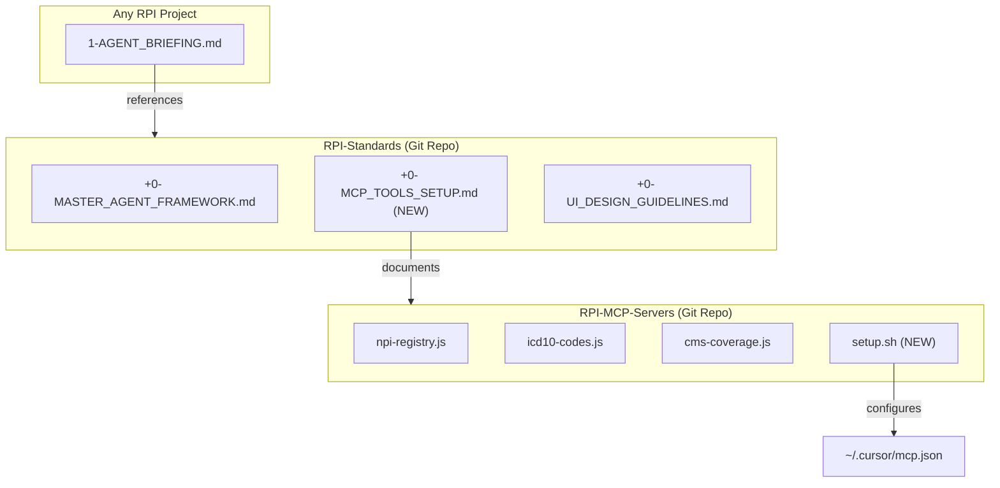

# Add MCP Tools Documentation to RPI-Standards

## Overview

Create a new standards document in `RPI-Standards/` that documents the MCP servers, how to set them up, and what tools are available. This ensures any agent starting on any project knows about and can use the healthcare MCP tools.

## Architecture



## Changes

### 1. Create MCP Standards Document

**File:** [`RPI-Standards/+0- MCP_TOOLS_SETUP.md`](RPI-Standards/+0- MCP_TOOLS_SETUP.md)

Contents:
- What MCP is (brief explanation)
- Available RPI MCP servers (NPI, ICD-10, CMS Coverage)
- Setup instructions (clone, npm install, run setup script)
- Tool reference table (what each tool does)
- Example queries
- Troubleshooting

### 2. Add Setup Script to MCP Repo

**File:** [`RPI-MCP-Servers/setup.sh`](RPI-MCP-Servers/setup.sh)

A simple bash script that:
- Detects the current repo path
- Updates `~/.cursor/mcp.json` with correct absolute paths
- Preserves existing MCP server configs (like figma-desktop)
- Works on any machine after cloning

### 3. Update Master Framework (Optional)

**File:** [`RPI-Standards/+0- MASTER_AGENT_FRAMEWORK.md`](RPI-Standards/+0- MASTER_AGENT_FRAMEWORK.md)

Add a brief section in the appendix pointing to the MCP setup doc for agents who need healthcare data access.

## Portability Flow

```
New Machine Setup:
1. Clone RPI-Standards (already part of onboarding)
2. Clone RPI-MCP-Servers
3. cd RPI-MCP-Servers && npm install && ./setup.sh
4. Restart Cursor
5. MCP tools available in all projects
```

## Files Modified/Created

| File | Action |
|------|--------|
| `RPI-Standards/+0- MCP_TOOLS_SETUP.md` | Create |
| `RPI-MCP-Servers/setup.sh` | Create |
| `RPI-Standards/+0- MASTER_AGENT_FRAMEWORK.md` | Update (add reference) |
