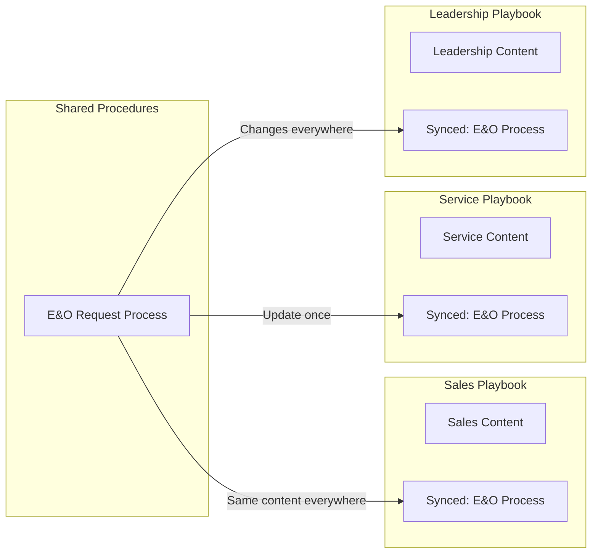

# Notion Knowledge Base for RPI Playbooks

## Why Notion Solves Your Specific Problems

| Your Pain Point | How Notion Fixes It |
|-----------------|---------------------|
| **Hard to find things** | Instant full-text search + AI-powered "Ask" feature |
| **Content out of sync** | **Synced Blocks** - write once, appears everywhere, update once |
| **Slow onboarding** | Beautiful home page with guided navigation + linked databases |
| **Painful updates** | Change a synced block in one place, it updates in ALL docs |

## What is Notion?

Notion is a collaborative workspace (like Google Docs meets a wiki meets a database). It's used by companies like Figma, Pixar, and Nike for internal documentation.

- Free for small teams (up to 10 guests)
- $10/user/month for full team access
- Works on web, Mac, Windows, iOS, Android

## The Migration Plan

### Phase 1: Setup and Structure (Day 1)

1. Create RPI Notion workspace
2. Build the navigation structure:

```
RPI Knowledge Base (Home)
├── Quick Links (for common tasks)
├── Sales
│   ├── Medicare Process
│   └── Retirement Process
├── Service
│   └── Incoming Communication
├── Support
│   └── Correspondence Handling
├── Shared Procedures (synced blocks live here)
│   ├── ProDash Contact Creation
│   ├── E&O Certificate Request
│   ├── Opportunity Stages
│   └── GHL Basics
└── Team Directory
    ├── Job Descriptions
    └── Onboarding Checklists
```

### Phase 2: Import and Restructure (Days 2-3)

1. Import your Google Docs directly (Notion has a Google Docs importer)
2. Identify duplicated content across playbooks
3. Extract shared procedures into **Synced Blocks**
4. Replace duplicates with synced block references

### Phase 3: Enhance for Discoverability (Day 4)

1. Create a searchable **Procedures Database** with tags (team, process type, tools used)
2. Build an **Onboarding Hub** that guides new hires through relevant docs
3. Add a **Quick Reference** page for most-used procedures
4. Enable Notion AI to answer questions about your docs

## Visual: How Synced Blocks Work



## Example: Your E&O Process Today vs. In Notion

**Today (Google Docs):**
- E&O steps written in Leadership Playbook
- Same steps copy/pasted in Sales Playbook
- Someone updates Leadership version
- Sales version is now outdated
- New hire reads wrong version

**In Notion:**
- E&O steps written ONCE as a synced block
- Embedded in Leadership, Sales, Service pages
- You update it in ONE place
- ALL pages show the update instantly
- Search "E&O" and find the canonical version

## Alternatives Considered

| Tool | Why Notion is Better for You |
|------|------------------------------|
| **MkDocs** | Requires maintaining Markdown files separately from Google Docs |
| **Google Sites** | No synced blocks, limited search, still have duplication problem |
| **Confluence** | More complex, enterprise-focused, overkill for your team size |
| **Slite** | Good but less flexible, smaller feature set |

## Next Steps

1. **Try it first**: I can help you set up a test workspace with ONE playbook migrated
2. **Validate**: Have a team member test search and navigation
3. **Full migration**: If it works, migrate remaining playbooks
4. **Training**: 30-minute walkthrough for your team

## Questions to Discuss

- Do you want me to help you create a Notion workspace structure based on your current docs?
- Should we start with one playbook as a proof of concept?
- Any concerns about data migration or team adoption?
