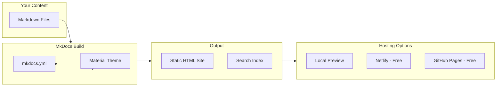

# Custom RPI Documentation Site

## What I'll Build

A professional documentation site using **MkDocs + Material theme** - the same setup used by Google, Microsoft, and AWS for their developer docs. It looks like this out of the box:

```
┌─────────────────────────────────────────────────────────────┐
│  🔍 Search (Cmd+K)                          RPI Playbooks   │
├───────────────────┬─────────────────────────────────────────┤
│                   │                                         │
│  Getting Started  │   Medicare Sales Process                │
│                   │   ════════════════════════════════════  │
│  ▶ Sales          │                                         │
│    Medicare       │   This guide covers the complete MSP    │
│    Retirement     │   workflow from lead to close...        │
│                   │                                         │
│  ▶ Service        │   ## Blue Stage (AST-1)                 │
│    Incoming       │                                         │
│    Fax/Email      │   When a lead enters Blue Stage:        │
│                   │   1. Verify contact exists in ProDash   │
│  ▶ Support        │   2. Check authorization status         │
│                   │   3. Create opportunity...              │
│  ▶ Reference      │                                         │
│    ProDash 101    │   !!! tip "Pro Tip"                     │
│    E&O Process    │       Always check for duplicates       │
│                   │       before creating new contacts.     │
│                   │                                         │
└───────────────────┴─────────────────────────────────────────┘
```

## Key Features (Zero Config Required)

- **Instant search** - Type anywhere, find anything in milliseconds
- **Dark/light mode** - Auto-switches based on system preference
- **Mobile responsive** - Works perfectly on phones
- **Table of contents** - Auto-generated from your headings
- **Copy buttons** - On all code blocks
- **Keyboard navigation** - Power users can fly through docs

## Technical Approach



## What I'll Do

### Step 1: Set Up Project Structure

Create the MkDocs scaffolding in your project:

```
CEO Dashboard/
├── mkdocs.yml           # Configuration (I'll set this up)
├── docs/
│   ├── index.md         # Home page
│   ├── sales/
│   │   ├── medicare.md
│   │   └── retirement.md
│   ├── service/
│   │   └── incoming.md
│   ├── support/
│   │   └── correspondence.md
│   └── reference/
│       ├── prodash-101.md
│       └── eao-process.md
```

### Step 2: Configure the Theme

Set up Material theme with:
- RPI branding colors (or clean defaults)
- Search enabled
- Navigation structure matching your team org

### Step 3: Migrate Your Content

Move and clean up your existing Markdown files:
- [ProDash 101.md](Docs/ProDash 101.md) - reference section
- [RPI- Leadership Team Playbook.md](Docs/RPI- Leadership Team Playbook.md) - extract shared procedures
- [RPI Sales Team- Playbook.md](Docs/RPI Sales Team- Playbook.md) - sales section
- [RPI Service Team- Playbook.md](Docs/RPI Service Team- Playbook.md) - service section
- [RPI Support Team- Playbook.md](Docs/RPI Support Team- Playbook.md) - support section

### Step 4: Local Preview

You'll be able to run `mkdocs serve` and see your docs at `localhost:8000` instantly.

### Step 5: Deploy (Optional)

When ready, deploy to Netlify or GitHub Pages for team access via a shareable URL.

## Workflow After Setup

```
Edit Markdown file → Save → Site auto-rebuilds → Team sees changes
```

No syncing, no copying, no Notion wrestling. Just edit files and save.

## Requirements

- Python 3.x (likely already installed on your Mac)
- pip install mkdocs-material

## Questions Before I Build

1. Any specific colors or branding you want? (Or I'll use clean defaults)
2. Should I reorganize the content into the structure above, or keep files as-is for now?
