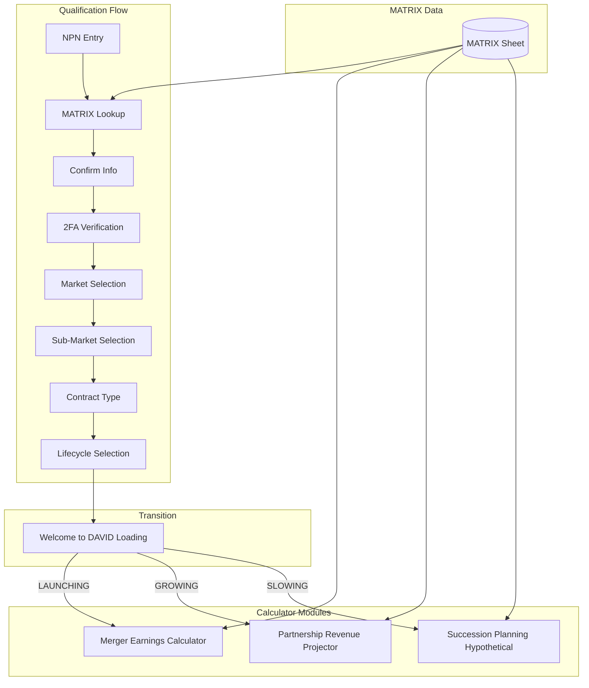

# DAVID-Hub: Qualification Flow + Calculator Modules

## Architecture Overview



## File Structure (in existing [DAVID-Projector](DAVID-Projector/) project)

```
DAVID-Projector/  (rename conceptually to DAVID-Hub)
├── Code.gs              # Entry point + routing
├── Config.gs            # Tiers, averages, settings
├── Auth.gs              # NEW: 2FA logic (Email + GHL SMS)
├── Matrix.gs            # NEW: MATRIX integration (NPN lookup, Comp Grid)
├── HYPO.gs              # Existing PRP calculations
├── MEC.gs               # NEW: Merger Earnings calculations
├── SPH.gs               # NEW: Succession Planning calculations
├── Index.html           # Main app shell + router
├── Styles.html          # Shared CSS
├── Scripts.html         # Shared JS utilities
└── appsscript.json
```

---

## Phase 1: Qualification Flow

### Step 1: NPN Entry + MATRIX Lookup

- Input field for 11-digit NPN
- Call MATRIX AGENT MASTER tab to validate
- Pull: Name, Email, Phone, Business Address
- Display pre-filled form for confirmation

### Step 2: 2FA Verification

- User can choose Email or SMS
- Email: GAS MailApp sends 6-digit code
- SMS: GHL API webhook sends code
- 5-minute expiry, 3 attempts max

### Step 3: Market Selection

Four avatar panels (single-select):

| Market | Icon | Description |

|--------|------|-------------|

| Health | Heart | ACA, Medicare |

| Wealth | Chart | Annuities, BD/RIA |

| Legacy | Shield | Life Insurance |

| Senior | Star | H + W + L Combined |

### Step 4: Sub-Market Selection (multi-select based on Market)

- Health: ACA, Medicare
- Wealth: Annuity, BD/RIA
- Legacy: Universal Life, Final Expense
- Senior: Medicare + Life + Annuity

### Step 5: Contract Type (multi-select)

- Retail Agent (Direct / LOA)
- Registered Rep (B/D) / IAR (RIA)
- GA/MGA/BGA (LOA / Direct Agents)
- Wholesale FMO/IMO/NMO
- B/D Firm Owner / RIA Firm Owner

### Step 6: Lifecycle Selection

"My short-term (0-3 year) business objective is:"

| Option | Routes To |

|--------|-----------|

| Launching | MEC |

| Growing | PRP |

| Slowing | SPH |

### Step 7: Loading Screen

"Welcome to DAVID." with animation while calculator loads with pre-filled agency info.

---

## Phase 2: MEC (Merger Earnings Calculator)

**Target:** LAUNCHING agent with existing practice, not yet a business

**Inputs:**

- Existing client count
- Current annual production ($)
- Product specialty (from qualification)
- Hours/week on non-sales activities
- Current commission split %

**Outputs:**

- Year 1 DAVID earnings projection
- Side-by-side: Current vs DAVID Model
- Cross-sell revenue opportunity
- Time reclaimed (hours/week)
- Break-even analysis

**Key Message:** "Smaller slice of a MUCH bigger pie = more money + more time"

---

## Phase 3: SPH (Succession Planning Hypothetical)

**Target:** SLOWING agent looking to exit

**Dual Perspective:**

1. **Seller View:** What is my book worth?
2. **DAVID View:** What would DAVID offer?

**Inputs:**

- Total clients / Active clients
- Annual recurring revenue
- Client demographics (age distribution)
- Product mix
- Years in business
- Desired exit timeline

**Outputs:**

- Book valuation estimate (multiple methods)
- DAVID acquisition offer range
- Payout structure options (lump sum vs earnout)
- Transition timeline
- Legacy options (stay as consultant?)

---

## Phase 4: MATRIX Integration

### AGENT MASTER Tab (lookup)

- NPN (key)
- Name, Email, Phone, Address
- Licenses, States
- Contract status

### Comp Grid Tab (new - consumed by calculators)

- Commission tiers by product
- Override structures
- Merger terms
- Acquisition multiples

---

## Implementation Order

1. **Qualification Flow UI** - Multi-step wizard in Index.html
2. **Matrix.gs** - NPN lookup + Comp Grid consumption
3. **Auth.gs** - 2FA with Email + GHL SMS
4. **Routing Logic** - Lifecycle to calculator mapping
5. **MEC.gs + UI** - Merger Earnings Calculator
6. **SPH.gs + UI** - Succession Planning Hypothetical
7. **Testing + Polish**

---

## Technical Notes

- **Existing PRP code** stays in HYPO.gs, becomes one of three modules
- **Admin auth** (Google Workspace) already implemented - carries forward
- **GHL Integration** requires API endpoint for SMS (will need webhook URL)
- **MATRIX_ID** already configured in script properties